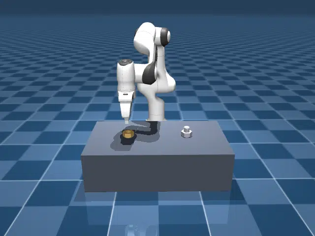

# Franka Emika Panda

## Description

Measures MuJoCo Warp throughput for the Franka Emika Panda in idle and threading scenes.

### franka_emika_panda

| Property | Value |
|----------|-------|
| Bodies | 12 |
| DoFs | 9 |
| Actuators | 8 |
| Geoms | 23 |
| Timestep | 0.005s |
| Solver | Newton |
| Friction | Pyramidal |
| Integrator | ImplicitFast |
| Matrix Format | Dense |

### panda_threading

A Franka Emika Panda arm picks up a nut from the table, aligns it above a fixed threaded bolt,
and threads it down to the base flange using convex decomposition meshes (51 bolt pieces and 167 nut pieces).
The rollout averages approximately 23 contacts and 126 constraint rows per world (p95: 24 and 173),
fitting within the 512-contact and 4096-constraint capacities.

| Property | Value |
|----------|-------|
| Bodies | 14 |
| DoFs | 15 |
| Actuators | 8 |
| Geoms | 306 |
| Timestep | 0.002s |
| Solver | Newton |
| Friction | Pyramidal |
| Integrator | ImplicitFast |
| Matrix Format | Sparse |
| Parallel Worlds | 1024 |
| Contact Capacity / World | 512 |
| Constraint Capacity / World | 4096 |

