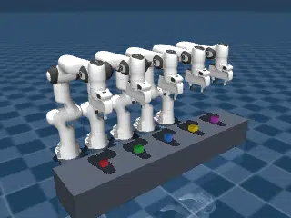

# Franka Emika Panda

## Description

Measures MuJoCo Warp throughput for Panda robots.

### franka_emika_panda

| Property | Value |
|----------|-------|
| Bodies | 12 |
| DoFs | 9 |
| Actuators | 8 |
| Geoms | 81 |
| Timestep | 0.005s |
| Solver | Newton |
| Friction | Pyramidal |
| Integrator | ImplicitFast |
| Matrix Format | Dense |

### franka_emika_pandas

Five independent Panda arms sequentially pick up colored objects of different sizes
from a table and lift them back to their home configuration. Each arm begins at the
Menagerie home keyframe pose, descends to pinch-grip its designated object, and raises
it back to the home height, holding all five objects aloft.

| Property | Value |
|----------|-------|
| Bodies | 61 |
| DoFs | 75 |
| Actuators | 40 |
| Geoms | 407 |
| Timestep | 0.005s |
| Solver | Newton |
| Friction | Pyramidal |
| Integrator | ImplicitFast |
| Matrix Format | Sparse |
| Parallel Worlds | 8192 |
| Contact Capacity / World | 48 |
| Constraint Capacity / World | 192 |

