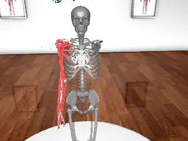

# MyoSim MyoArm

## Description

The [MyoArm](https://github.com/MyoHub/myo_sim/tree/main/arm) is a musculoskeletal model of the human arm from the [MyoSim](https://github.com/MyoHub/myo_sim) project. It features 63 muscle-tendon actuators driving 38 degrees of freedom, making it a demanding benchmark for MuJoCo Warp's tendon and actuation pipelines.

### myoarm

| Property | Value |
|----------|-------|
| Bodies | 40 |
| DoFs | 38 |
| Actuators | 63 |
| Geoms | 161 |
| Timestep | 0.002s |
| Solver | Newton |
| Friction | Pyramidal |
| Integrator | Euler |
| Matrix Format | Sparse |

