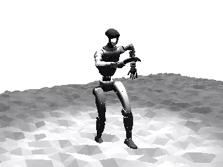

# Unitree G1

## Description

Full-body humanoid locomotion benchmark using the [Unitree G1](https://www.unitree.com/g1/) (29 DOF) with capsule-based collision geometry. Designed for locomotion with simulation settings matching those used for training in [mjlab](https://github.com/mujocolab/mjlab). Two scene variants test performance on flat terrain and randomized heightfield terrain.

### unitree_g1_flat

Replaying an mjlab rollout of a shuffle dance on flat terrain.

| Property | Value |
|----------|-------|
| Bodies | 31 |
| DoFs | 35 |
| Actuators | 29 |
| Geoms | 69 |
| Timestep | 0.005s |
| Solver | Newton |
| Friction | Pyramidal |
| Integrator | Implicit Fast |
| Matrix Format | Sparse |

### unitree_g1_hfield

Replaying the same shuffle dance sequence on randomized heightfield terrain.  The `ctrl` sequence was copied from the flat ground scene, so falling is expected.

| Property | Value |
|----------|-------|
| Bodies | 31 |
| DoFs | 35 |
| Actuators | 29 |
| Geoms | 69 |
| Timestep | 0.005s |
| Solver | Newton |
| Friction | Pyramidal |
| Integrator | Implicit Fast |
| Matrix Format | Sparse |

### unitree_g1_hfield_render

GPU ray-traced rendering of the `scene_hfield.xml` scene with a shuffle dance rollout. This benchmark measures RGB rendering performance of heightfield terrain and robot meshes.

| Property | Value |
|----------|-------|
| Bodies | 31 |
| DoFs | 35 |
| Actuators | 29 |
| Geoms | 69 |
| Cameras | 2 |
| Resolution | 64×64 |
| Worlds | 8192 |

